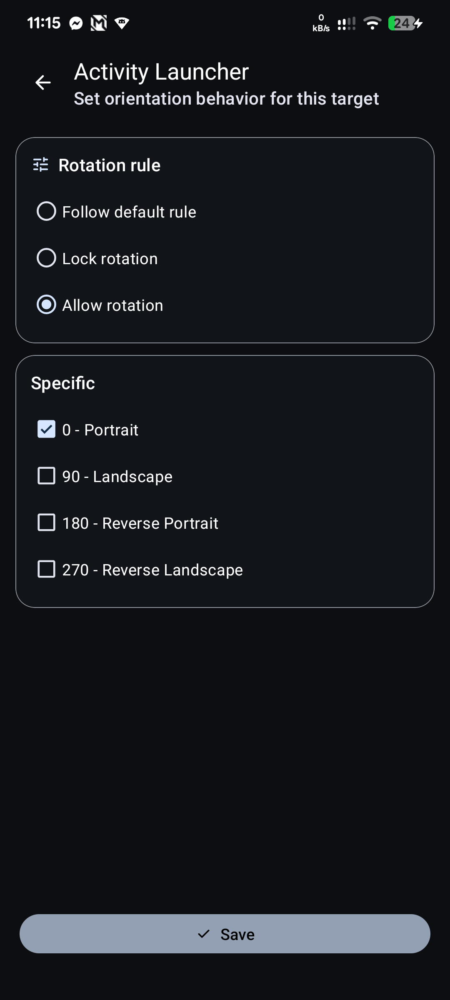

# Real AutoRotate

[](https://developer.android.com/about/versions)
[](LICENSE)

Real AutoRotate keeps screen rotation aligned with the app you are using. The current build features a Material You interface, a searchable app picker, per-app rotation rules, and optional privileged backends for stronger enforcement.

Original repository: [teja2495/real-autorotate](https://github.com/teja2495/real-autorotate)

## Features

- Material 3 and Material You styling with Material Symbols icons
- Searchable app picker with tap-to-add flow
- Per-app rules for follow default, lock rotation, allow rotation, and specific orientations
- Backend modes for auto, accessibility, root, and Shizuku
- Battery optimization guidance and stable foreground tracking
- Offline by design

## Screenshots

| Onboarding                                    | Main screen                                         |
| --------------------------------------------- | --------------------------------------------------- |
|  |        |
| App picker                                    | Rotation config                                     |
|        |  |

## Installation

### From source

```bash
git clone <repository-url>
cd real-autorotate
./gradlew assembleDebug
```

Install `app/build/outputs/apk/debug/app-debug.apk` on a connected device or emulator.

## Setup

1. Open the app and grant Usage Access.
2. Grant Modify System Settings unless a privileged backend is available.
3. Disable battery optimization for the app when prompted.
4. Tap the floating action button to add an app.
5. Tap a rule card to edit its rotation behavior.
6. Use the service switch to start or stop enforcement.

## Settings

Open the toolbar settings button to choose the backend mode. Auto picks the best available backend and falls back to the standard permission path when no privileged helper is available.

## Permissions

| Permission                             | Purpose                                      | Required                                     |
| -------------------------------------- | -------------------------------------------- | -------------------------------------------- |
| `PACKAGE_USAGE_STATS`                  | Detect the foreground app                    | Yes                                          |
| `WRITE_SETTINGS`                       | Apply rotation changes in accessibility mode | Yes unless a privileged backend is available |
| `REQUEST_IGNORE_BATTERY_OPTIMIZATIONS` | Keep background monitoring reliable          | Yes                                          |

## Architecture

- Language: Java
- Pattern: MVVM
- Minimum SDK: 24
- Target SDK: 35

### Project Structure

```text
app/src/main/java/com/example/autorotate/
├── Model/
│   └── AppsInfo.java
├── Service/
│   ├── realAutorotateService.java
│   └── RotationService.java
├── UI/
│   ├── MainActivity.java
│   ├── AppSelectionActivity.java
│   ├── AppRotationConfigActivity.java
│   ├── OnboardingActivity.java
│   ├── SettingsActivity.java
│   └── SettingsFragment.java
├── Util/
│   ├── OperationMode.java
│   ├── OperationModeStore.java
│   ├── PermissionGate.java
│   ├── RotationBackend.java
│   ├── RotationSettings.java
│   └── UsageStatsHelper.java
└── ViewModel/
    ├── MainViewModel.java
    └── AppsRepository.java
```

## Notes

- Auto mode falls back to the standard permission path when no privileged backend is available.
- The service reasserts rotation after brief home or recents transitions.
- The app does not use the network.

## License

Licensed under the MIT License. See [LICENSE](LICENSE).
See [Privacy Policy](PRIVACY_POLICY.md) for data handling details.
