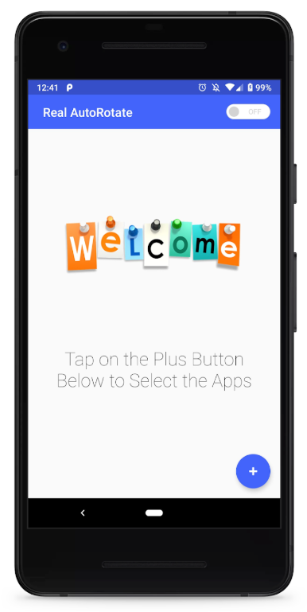
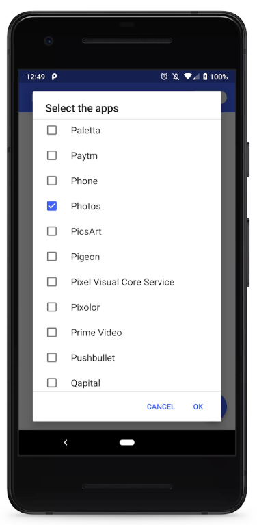
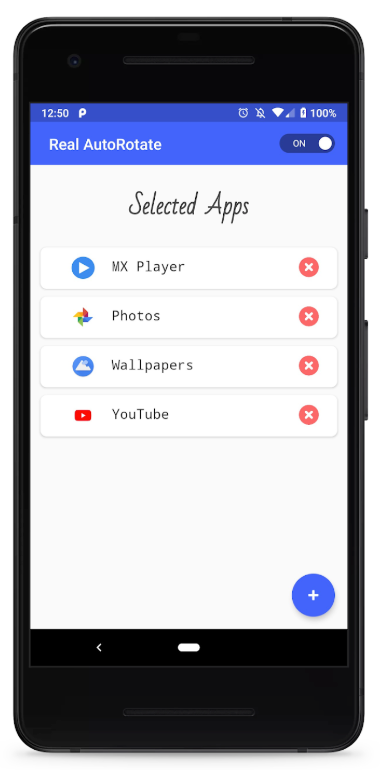

# Real AutoRotate

[](https://developer.android.com/about/versions)
[](LICENSE)
[](https://play.google.com/store/apps/details?id=com.first.teja2.realautorotate)

An intelligent Android application that automatically manages auto-rotate settings based on the foreground application. Say goodbye to accidentally rotated screens when switching between apps!

## 🎯 Features

- **App-Specific Auto-Rotate**: Automatically enables auto-rotate only for selected applications
- **Smart Background Service**: Monitors foreground apps and manages rotation settings seamlessly
- **User-Friendly Interface**: Simple and intuitive app selection interface
- **No Internet Required**: Works completely offline - no data sent to external servers
- **Battery Efficient**: Lightweight background service with minimal resource usage

## 🚀 How It Works

Real AutoRotate solves the common problem of forgetting to disable auto-rotate after using apps like YouTube or Photo Gallery. The app:

1. **Monitors** which application is currently in the foreground
2. **Automatically enables** auto-rotate for your selected apps
3. **Disables** auto-rotate when switching to other applications
4. **Runs silently** in the background without interfering with your workflow

## 📱 Screenshots

| Welcome Screen | App Selection | Selected Apps |
|----------------|---------------|---------------|
|  |  |  |

## 📱 Installation

### From Google Play Store
1. Download from [Google Play Store](https://play.google.com/store/apps/details?id=com.first.teja2.realautorotate)
2. Install and launch the app
3. Grant required permissions when prompted

### From Source Code
```bash
git clone https://github.com/yourusername/real-autorotate.git
cd real-autorotate
./gradlew assembleDebug
```

## 🔧 Setup Instructions

### Step 1: Grant Permissions
When you first open the app, it will request necessary permissions:
- **Usage Stats Permission**: Required to detect which app is in the foreground
- **Write Settings Permission**: Required to toggle auto-rotate settings

### Step 2: Select Applications
1. Tap the "Select Apps" icon in the bottom right corner
2. Choose the applications where you want auto-rotate enabled
3. Press "OKAY" to confirm your selection

### Step 3: Enable Service
1. Toggle the service switch in the top right corner
2. Grant any additional permissions if prompted

### Step 4: Enjoy!
The app will now automatically manage auto-rotate settings based on your selected applications.

## ⚙️ Configuration

### Adding/Removing Apps
- **To add apps**: Tap "Select Apps" and check the desired applications
- **To remove apps**: Uncheck the app from the selection list

### Manual Override
If you need to manually control auto-rotate settings, simply disable the service toggle within the app.

## 🔒 Permissions Explained

| Permission | Purpose | Required |
|------------|---------|----------|
| `PACKAGE_USAGE_STATS` | Detects which app is currently in the foreground | ✅ Yes |
| `WRITE_SETTINGS` | Toggles system auto-rotate setting | ✅ Yes |

**Note**: The app does not require internet connectivity and does not send any data to external servers.

## 🏗️ Architecture

- **Pattern**: MVVM (Model-View-ViewModel)
- **Language**: Java
- **Minimum SDK**: API 21 (Android 5.0)
- **Target SDK**: Latest stable Android version

### Project Structure
```
app/src/main/java/com/first/teja2/realautorotate/
├── Model/
│   └── AppsInfo.java
├── Service/
│   └── realAutorotateService.java
├── UI/
│   ├── MainActivity.java
│   └── ItemAdapter.java
└── ViewModel/
    ├── MainViewModel.java
    └── AppsRepository.java
```

## ⚠️ Important Notes

- **Don't remove from recent apps**: The service stops if the app is removed from the recent apps screen
- **Service restart**: If accidentally removed, simply open the app again to re-enable the service
- **Manual override**: Disable the service within the app if you want to manually control auto-rotate

## 🤝 Contributing

Contributions are welcome! Please feel free to submit a Pull Request.

### Development Setup
1. Fork the repository
2. Create a feature branch (`git checkout -b feature/amazing-feature`)
3. Commit your changes (`git commit -m 'Add amazing feature'`)
4. Push to the branch (`git push origin feature/amazing-feature`)
5. Open a Pull Request

## 📄 License

This project is licensed under the MIT License - see the [LICENSE](LICENSE) file for details.

### License Summary
- **Type**: MIT License
- **Year**: 2024
- **Copyright**: Real AutoRotate
- **Permissions**: 
  - ✅ Commercial use
  - ✅ Modification
  - ✅ Distribution
  - ✅ Private use
- **Limitations**: 
  - ❌ No liability
  - ❌ No warranty
- **Conditions**: 
  - 📋 License and copyright notice must be included

### Third-Party Licenses
This project uses the following open-source libraries:
- **Foreground App Checker**: [ricvalerio/foregroundappchecker](https://github.com/ricvalerio/foregroundappchecker) - Used for detecting foreground applications
- **Android Toggle**: [Angads25/android-toggle](https://github.com/Angads25/android-toggle) - Used for toggle button UI component

For detailed license information of third-party libraries, please refer to their respective repositories.

## 🙏 Credits

- **App Icon**: Designed by [Freepik](https://www.flaticon.com/) from [Flaticon](https://www.flaticon.com/)
- **Foreground App Checker**: [ricvalerio/foregroundappchecker](https://github.com/ricvalerio/foregroundappchecker)
- **Toggle Button**: [Angads25/android-toggle](https://github.com/Angads25/android-toggle)

## 📞 Support

If you encounter any issues or have questions:
- Create an issue on GitHub
- Rate the app on Google Play Store
- Leave feedback in the app

## 📋 Legal

- [Privacy Policy](PRIVACY_POLICY.md) - Learn how we handle your data

---

**Made with ❤️ for Android users who want smarter auto-rotate control**
